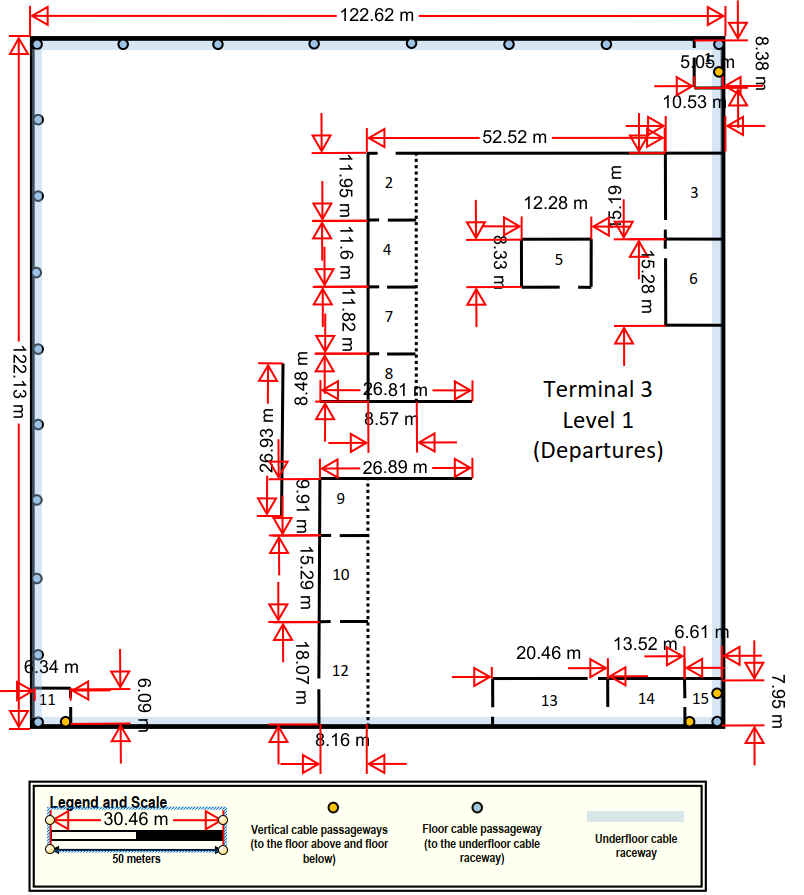
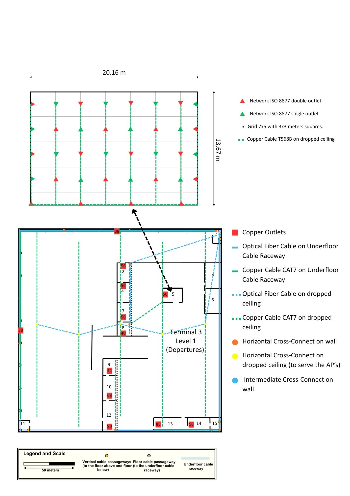
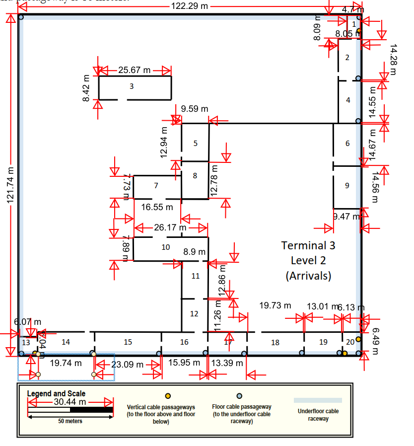
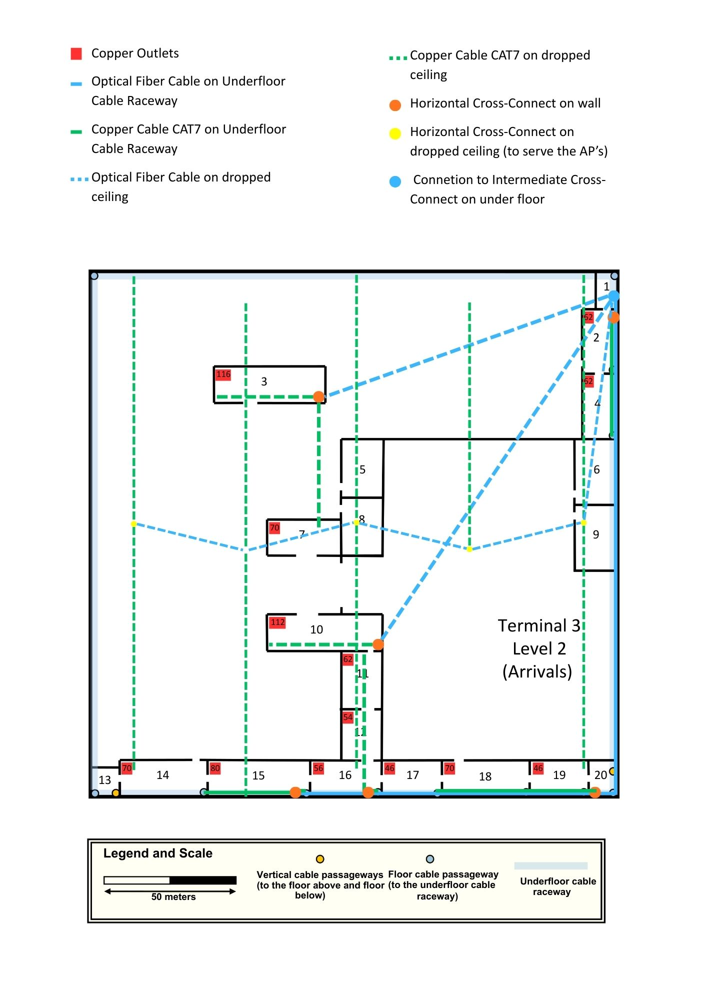

RCOMP 2025-2026 Project 1 - Sprint 1 - Member 1241210 folder
===========================================
## Terminal 3 LVL 0

## Selection of HCs for Level 0 of Terminal 3

According to the ISO/IEC standard, which specifies that copper cabling cannot exceed **90 meters in length**, the main HC initially placed in **Room 1** would not be sufficient to support the entire network on **Level 0**.

Therefore:

- **Room 1:** (upper right corner) **IC** (1 enclosure)
- **Room 1:** **North-East HC** (1 enclosure)
- **Room 15:** **South-East HC** zone (1 racks)
- **Upper Wall:** **North-West HC** (1 racks)
- **Left Wall:** **West HC** (1 enclosure)
- **Room 12:** **South HC** (1 racks)
- **Room 2** **Center-Up HC** (1 racks)
- **Room 8** **Center-Down HC** (1 racks)
- **Dropped Ceiling** **Center-Ap1 HC** (1 enclosure)
- **Dropped Ceiling** **Center-Ap2 HC** (1 enclosure)
- **Dropped Ceiling** **Center-Ap3 HC** (1 enclosure)
- **Dropped Ceiling** **Center-Ap4 HC** (1 enclosure)
- **Dropped Ceiling** **Center-Ap5 HC** (1 enclosure)

### Actual Measurement of the Rooms Presented in the Sprint Plan and Corresponding Work Areas

| Room  | Mesures (m)   | Outlets |
|-------|---------------|---------|
| 2     | 19.62 × 14.07 | 56      |
| 4     | 19.04 × 14.07 | 56      |
| 5     | 13.67 × 20.16 | 56      |
| 7     | 19.40 × 14.07 | 56      |
| 8     | 13.92 × 14.07 | 40      |
| 9     | 16.27 × 13.39 | 44      |
| 10    | 25.10 × 13.39 | 68      |
| 12    | 29.66 × 13.39 | 80      |
| 13    | 13.05 × 33.59 | 88      |
| 14    | 13.05 × 22.19 | 58      |
| Hight | 190.48        | 38      |
| Wight | 187.52        | 48      |

### Diagram of the Connections Between ICs and HCs

The distribution of outlets per room follows the following standard for all rooms (representation of Room 5 with 56 outlets)

### Wi-Fi Distribution Across the Entire Terminal (Distribution Using Access Points)

> **Note:** The connection to HC-AP's is shown in the previous diagram.

A total of **30 access points** were used on **Level 0 of Terminal 3**, distributed homogeneously across the floor, as shown in the following image:

### Table of the Corresponding Connections to the APs

| Distributor   | Number of Connected APs |
|---------------|-------------------------|
| Center-Ap1 HC | 6                       |
| Center-Ap2 HC | 6                       |
| Center-Ap3 HC | 6                       |
| Center-Ap4 HC | 6                       |
| Center-Ap5 HC | 6                       |

### Patch Panels

Example of Patch Panel Sizing Calculation  
For the **Center-Up HC**

In the **Center-Up HC (Room 2)**, the following are connected:

- **168 copper ports**
    - Rooms 2, 4, and 7
- **2 fiber ports**
    - 1 incoming connection from the **IC**
    - 1 outgoing connections to **Center-Down HC**

Copper  
168 / 24 = 7 → **7 patch panels**

Occupied space:    
7 × 1U = **7U**

Fiber  
2 / 24 = 0.083(3) → **1 patch panel**

Occupied space:  
1 × 1U = **1U**

Total  
7U + 1U = **8U**

Oversizing ×4  
8U × 4 = **32U**

Since a typical rack has **42U**, and also considering the practical limit of approximately **200** useful outlets per rack, the **North HC requires 2 racks of 42U**.

| Distribution Point | Copper Ports | Copper Patch Panels (24p) | Copper U | Fiber Ports | Fiber Patch Panels (24p) | Fiber U | Total U | U with Oversizing ×4 | Recommended Rack |
|--------------------|-------------:|--------------------------:|---------:|------------:|-------------------------:|--------:|--------:|---------------------:|------------------|
| IC                 |            0 |                         0 |       0U |           4 |                        1 |      1U |      1U |                   4U | 1 enclosure 6U   |
| North-East Hc      |           15 |                         1 |       1U |           2 |                        1 |      1U |      2U |                   8U | 1 enclosure 9U   |
| South-East Hc      |          146 |                         7 |       7U |           2 |                        1 |      1U |      9U |                  36U | 1 racks de 42U   |
| North-West HC      |           31 |                         2 |       2U |           2 |                        1 |      1U |      4U |                  16U | 1 racks de 42U   |
| West HC            |           30 |                         2 |       2U |           1 |                        1 |      1U |      3U |                  12U | 1 enclosure 12U  |
| South HC           |          192 |                         8 |       8U |           1 |                        1 |      1U |      9U |                  36U | 1 racks de 42U   |
| Center-Up HC       |          168 |                         7 |       7U |           2 |                        1 |      1U |      9U |                  36U | 1 racks de 42U   |
| Center-Down HC     |           96 |                         4 |       4U |           1 |                        1 |      1U |      5U |                  20U | 1 racks de 42U   |
| Center-Ap1 HC      |            6 |                         1 |       1U |           2 |                        1 |      1U |      2U |                   8U | 1 enclosure 9U   |
| Center-Ap2 HC      |            6 |                         1 |       1U |           2 |                        1 |      1U |      2U |                   8U | 1 enclosure 9U   |
| Center-Ap3 HC      |            6 |                         1 |       1U |           2 |                        1 |      1U |      2U |                   8U | 1 enclosure 9U   |
| Center-Ap4 HC      |            6 |                         1 |       1U |           2 |                        1 |      1U |      2U |                   8U | 1 enclosure 9U   |
| Center-Ap5 HC      |            6 |                         1 |       1U |           1 |                        1 |      1U |      2U |                   8U | 1 enclosure 9U   |

### Final Inventory for the First Floor

| Element                | Quantity |
|------------------------|---------:|
| Room outlets           |      708 |
| APs                    |       30 |
| Total network points   |      751 |
| Copper patch panels    |       36 |
| Fiber patch panels     |       13 |
| 42U racks              |        5 |
| Enclosures (6U/9U/12U) |        8 |

## Terminal 3 LVL 1

## Selection of HCs for Level 1 of Terminal 3

Therefore:

- **Room 2:** **North-East HC** (1 racks)
- **Room 20:** **South-East HC** zone (1 racks)
- **Room 16:** **South-Center HC** (1 rack)
- **Room 15** **South-Left HC** (1 racks)
- **Room 13** **Center-up HC** (1 racks)
- **Room 10** **Center-Down HC** (1 racks)
- **Dropped Ceiling** **Center-Ap1 HC** (enclosure)
- **Dropped Ceiling** **Center-Ap2 HC** (enclosure)
- **Dropped Ceiling** **Center-Ap3 HC** (enclosure)
- **Dropped Ceiling** **Center-Ap4 HC** (enclosure)
- **Dropped Ceiling** **Center-Ap5 HC** (enclosure)

### Actual Measurement of the Rooms Presented in the Sprint Plan and Corresponding Work Areas

| Room | Mesures (m)   | Outlets |
|------|---------------|---------|
| 2    | 23.46 × 13.09 | 62      |
| 3    | 13.83 × 42.16 | 116     |
| 4    | 23.90 × 13.09 | 62      |
| 7    | 12.70 × 27.18 | 70      |
| 10   | 12.96 × 42.99 | 112     |
| 11   | 21.12 × 14.62 | 62      |
| 12   | 18.50 × 14.62 | 54      |
| 14   | 10.66 × 32.42 | 70      |
| 15   | 10.66 × 37.93 | 80      |
| 16   | 10.66 × 26.20 | 56      |
| 17   | 10.66 × 21.99 | 46      |
| 18   | 10.66 × 32.41 | 70      |
| 19   | 10.66 × 21.37 | 46      |

### Diagram of the Connections Between ICs and HCs

The distribution of outlets per room follows the following standard for all rooms (representation of Room 5 with 56 outlets)

### Wi-Fi Distribution Across the Entire Terminal (Distribution Using Access Points)

> **Note:** The connection to HC-AP's is shown in the previous diagram.

A total of **30 access points** were used on **Level 1 of Terminal 3**, distributed homogeneously across the floor, as shown in the following image:

### Table of the Corresponding Connections to the APs

| Distributor   | Number of Connected APs |
|---------------|-------------------------|
| Center-Ap1 HC | 6                       |
| Center-Ap2 HC | 6                       |
| Center-Ap3 HC | 6                       |
| Center-Ap4 HC | 6                       |
| Center-Ap5 HC | 6                       |

| Distribution Point | Copper Ports | Copper Patch Panels (24p) | Copper U | Fiber Ports | Fiber Patch Panels (24p) | Fiber U | Total U | U with Oversizing ×4 | Recommended Rack |
|--------------------|-------------:|--------------------------:|---------:|------------:|-------------------------:|--------:|--------:|---------------------:|------------------|
| North-East Hc      |          124 |                         6 |       6U |           1 |                        1 |      1U |      7U |                  28U | 1 racks de 42U   |
| South-East Hc      |          116 |                         5 |       5U |           2 |                        1 |      1U |      6U |                  24U | 1 racks de 42U   |
| South-Center HC    |          172 |                         8 |       8U |           2 |                        1 |      1U |      9U |                  36U | 1 racks de 42U   |
| South-Left HC      |          150 |                         7 |       7U |           1 |                        1 |      1U |      8U |                  32U | 1 racks de 42U   |
| Center-Up HC       |          186 |                         6 |       6U |           1 |                        1 |      1U |      7U |                  28U | 1 racks de 42U   |
| Center-Down HC     |          112 |                         5 |       5U |           1 |                        1 |      1U |      6U |                  24U | 1 racks de 42U   |
| Center-Ap1 HC      |            6 |                         1 |       1U |           2 |                        1 |      1U |      2U |                   8U | 1 enclosure 9U   |
| Center-Ap2 HC      |            6 |                         1 |       1U |           2 |                        1 |      1U |      2U |                   8U | 1 enclosure 9U   |
| Center-Ap3 HC      |            6 |                         1 |       1U |           2 |                        1 |      1U |      2U |                   8U | 1 enclosure 9U   |
| Center-Ap4 HC      |            6 |                         1 |       1U |           2 |                        1 |      1U |      2U |                   8U | 1 enclosure 9U   |
| Center-Ap5 HC      |            6 |                         1 |       1U |           1 |                        1 |      1U |      2U |                   8U | 1 enclosure 9U   |

### Final Inventory for the Second Floor

| Element                | Quantity |
|------------------------|---------:|
| Room outlets           |      890 |
| APs                    |       30 |
| Total network points   |      931 |
| Copper patch panels    |       42 |
| Fiber patch panels     |       11 |
| 42U racks              |        6 |
| Enclosures (6U/9U/12U) |        5 |

### Final Inventory for Terminal 3

| Element                | Quantity |
|------------------------|---------:|
| Room outlets           |     1598 |
| APs                    |       60 |
| Total network points   |     1682 |
| Copper patch panels    |       78 |
| Fiber patch panels     |       24 |
| 42U racks              |       11 |
| Enclosures (6U/9U/12U) |       13 |

