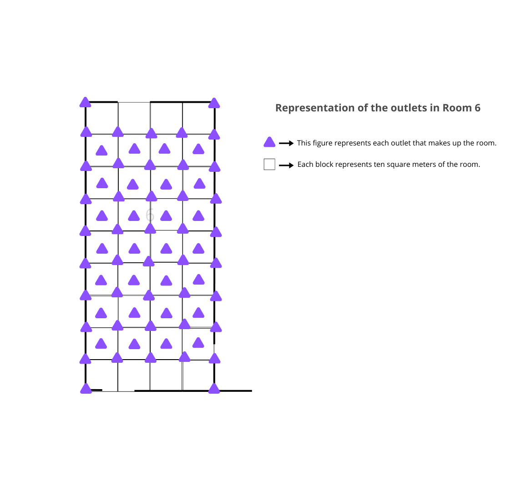
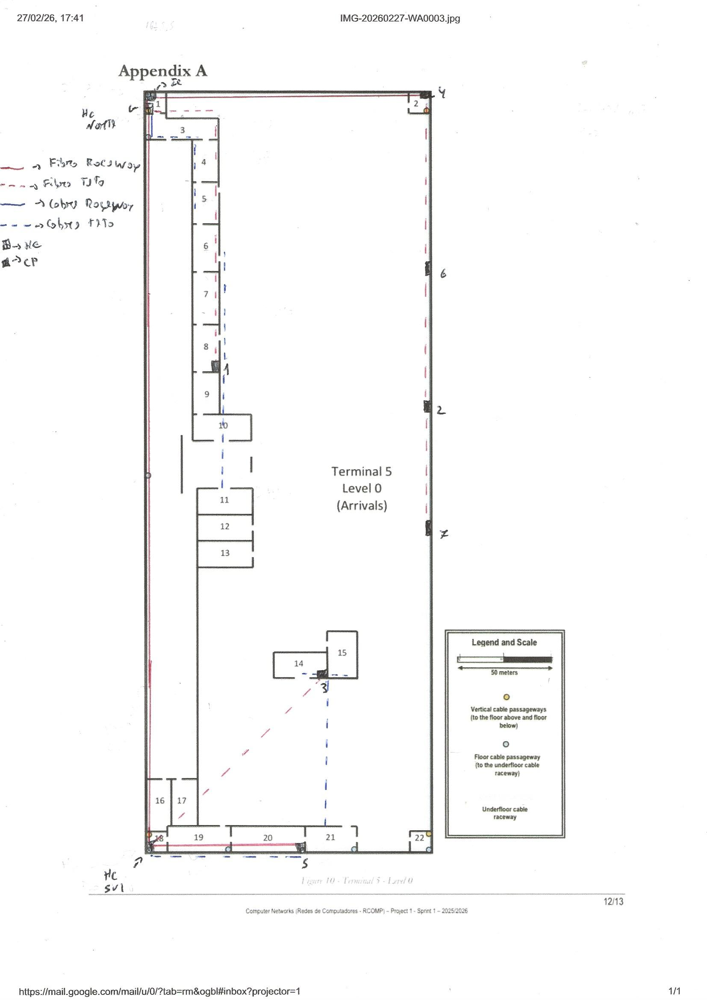
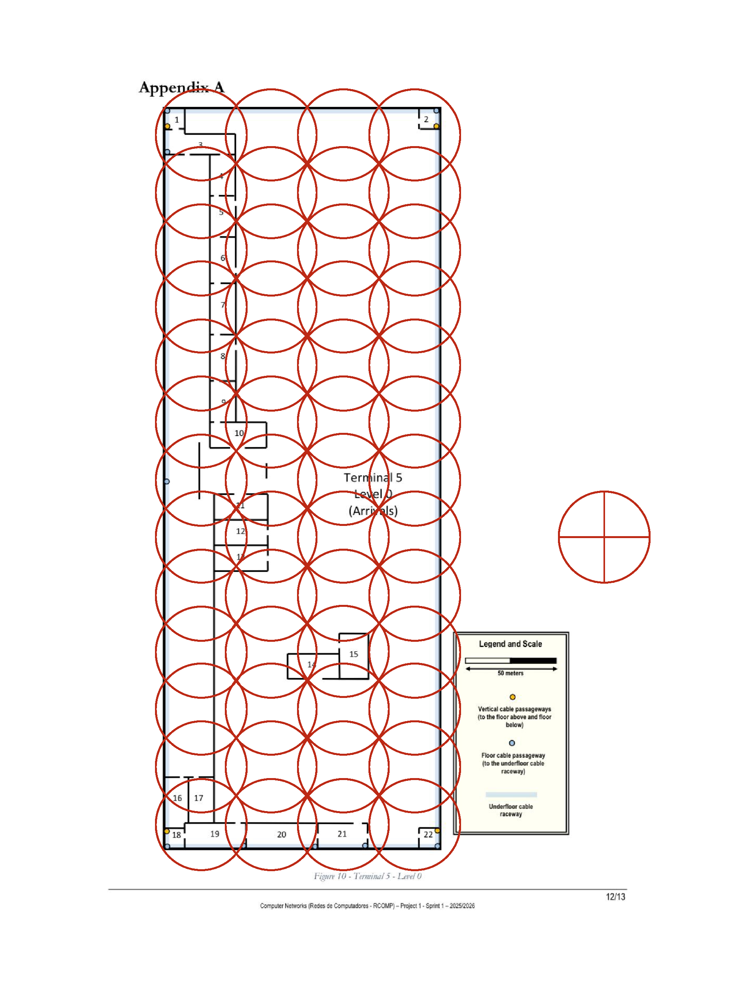
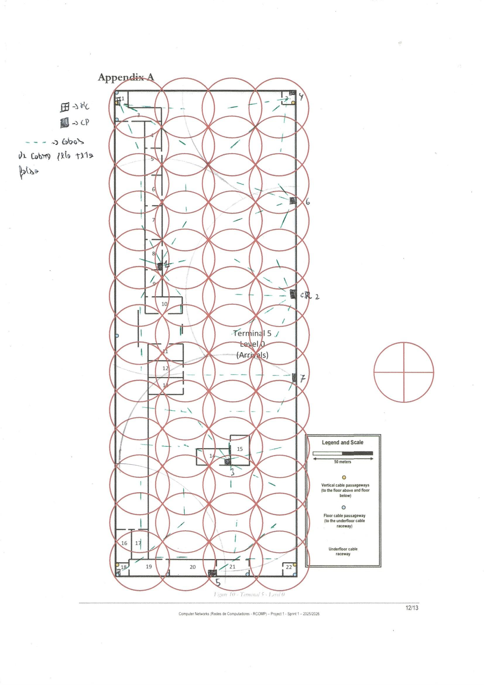
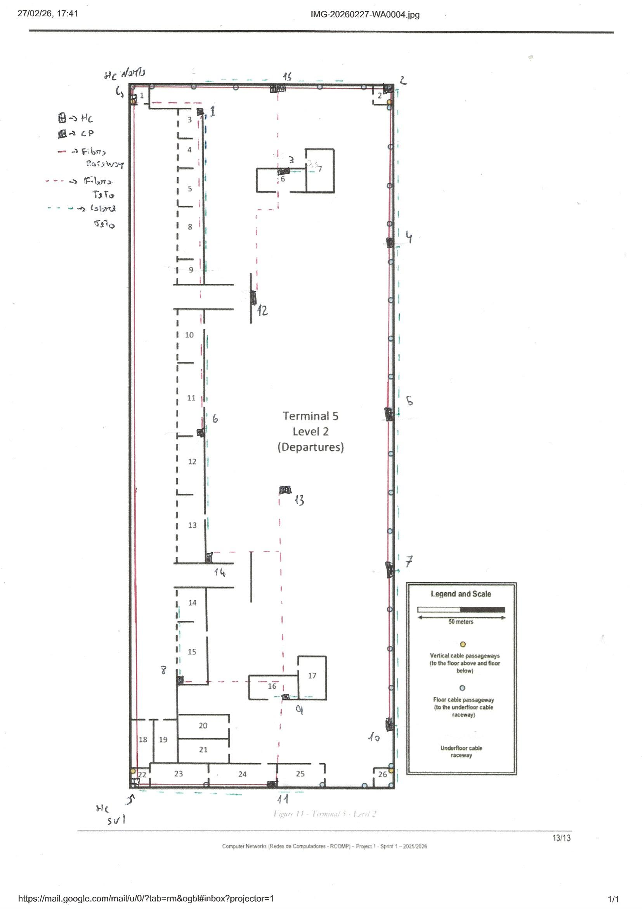
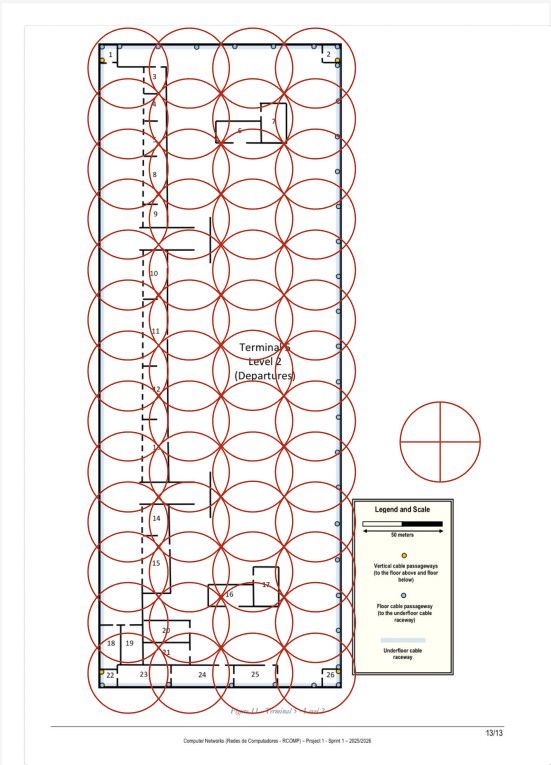
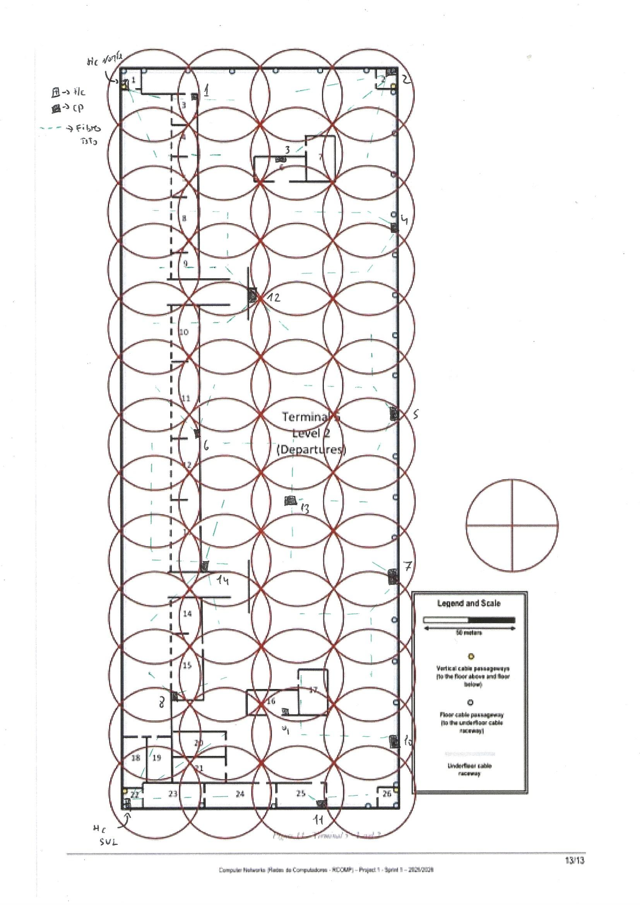

RCOMP 2025-2026 Project 1 - Sprint 1 - Member 1241442 folder
===========================================
## Terminal 5 LVL 0

## Selection of HCs for Level 0 of Terminal 5

According to the ISO/IEC standard, which specifies that copper cabling cannot exceed **90 meters in length**, the main HC initially placed in **Room 18** would not be sufficient to support the entire network on **Level 0**.

Therefore:

- **Room 1:** (upper left corner) **IC**
- **Room 1:** zone (lower left corner) **North HC** (2 racks/HC)
- **Room 18:** **South HC** zone (2 racks/HC)
- **Room 6:** **CP1** (3 racks/CP)
- **Center of the east exterior wall:** **CP2**
- **Room 14:** **CP3** (2 racks/CP)
- **Room 2:** **CP4**
- **Room 20:** **CP5**
- **Upper/central section of the east exterior wall:** **CP6**
- **Lower/central section of the east exterior wall:** **CP7**

### Actual Measurement of the Rooms Presented in the Sprint Plan and Corresponding Work Areas

| Room         | Mesures (cm) | Area (m²)  | WA = (A/10) | Outlets (2×WA) |
|--------------|--------------|------------|-------------|----------------|
| 3            | 2.2 × 0.7    | 491.1      | 50          | 100            |
| 4            | 0.8 × 1.2    | 306.1      | 31          | 62             |
| 5            | 0.8 × 1.2    | 306.1      | 31          | 62             |
| 6            | 0.8 × 1.4    | 357.1      | 36          | 72             |
| 7            | 0.8 × 1.5    | 382.7      | 39          | 78             |
| 8            | 0.8 × 1.4    | 357.1      | 36          | 72             |
| 9            | 0.8 × 1.2    | 306.1      | 31          | 62             |
| 10           | 1.6 × 0.8    | 408.2      | 41          | 82             |
| 11           | 1.6 × 0.8    | 408.2      | 41          | 82             |
| 14           | 1.6 × 0.8    | 408.2      | 41          | 82             |
| 15           | 0.9 × 1.4    | 401.8      | 41          | 82             |
| 19           | 1.9 × 0.8    | 484.7      | 49          | 98             |
| 20           | 2.2 × 0.8    | 561.2      | 57          | 114            |
| 21           | 1.5 × 0.8    | 382.7      | 39          | 78             |
| **Nº total** |              | **5561.2** | **563**     | **1126**       |

The distribution of outlets per room follows the following standard for all rooms (representation of Room 6 with 72 outlets):

> **Note:** All measurements were taken using the scale shown in the terminal representation, where **50 meters correspond to 2.8 cm**.

### Distances from IC to HC
| Room    | Distribution or Consolidation Point | Route in the Drawing | Calculation  | Total distamce | Cable type |
|---------|-------------------------------------|---------------------:|--------------|---------------:|-----------:|
| Room 1  | HC Norte                            |               0,7 cm | 0,7 × 17,86  |         12,5 m |      Fibra |
| Room 18 | HC Sul                              |              22.4 cm | 22.4 × 17,86 |          400 m |      Fibra |

### Distances from HC to CP

| Room | Distribution or Consolidation Point | Route in the Drawing | Calculation  | Total distance |
|------|-------------------------------------|---------------------:|--------------|---------------:|
| CP1  | HC Norte                            |                 9 cm | 9 × 17,86    |       160,74 m |
| CP2  | HC Norte                            |              17,5 cm | 17.5 × 17,86 |       312.55 m |
| CP3  | HC Sul                              |               7,4 cm | 7,4 × 17,86  |        132,1 m |
| CP4  | HC Norte                            |               8.5 cm | 8.5 × 17,86  |       151.81 m |
| CP5  | HC Sul                              |               4.5 cm | 4.5 × 17,86  |        80.37 m |
| CP6  | HC Norte                            |              13.5 cm | 13.5 × 17,86 |       241,11 m |
| CP7  | HC Sul                              |                21 cm | 21 × 17,86   |       375.06 m |

### Horizontal Distances from HC or CP to the Rooms

| Room    | Distribution or Consolidation Point |           Route in the Drawing | Calculation | Total distance | 
|---------|-------------------------------------|-------------------------------:|-------------|---------------:|
| Room 3  | HC Norte                            |             0,7 + 1,3 = 2,0 cm | 2,0 × 17,86 |         35,7 m |
| Room 4  | HC Norte                            |       0,7 + 1,3 + 0,6 = 2,6 cm | 2,6 × 17,86 |         46,4 m |
| Room 5  | HC Norte                            | 0,7 + 1,3 + 1,2 + 0,6 = 3,8 cm | 3,8 × 17,86 |         67,9 m |
| Room 6  | CP1                                 |                         3,5 cm | 3,5 × 17,86 |         62,5 m |
| Room 7  | CP1                                 |                         2,0 cm | 2,0 × 17,86 |         35,7 m |
| Room 8  | CP1                                 |                         0,5 cm | 0,5 × 17,86 |          8,9 m |
| Room 9  | CP1                                 |                         0,5 cm | 0,5 × 17,86 |          8,9 m |
| Room 10 | CP1                                 |                         1,2 cm | 1,2 × 17,86 |         21,4 m |
| Room 11 | CP1                                 |                         3,3 cm | 3,3 × 17,86 |         58,9 m |
| Room 14 | CP3                                 |                         0,5 cm | 0,5 × 17,86 |          8,9 m |
| Room 15 | CP3                                 |                         0,5 cm | 0,5 × 17,86 |          8,9 m |
| Room 19 | HC Sul                              |                         2,5 cm | 2,5 × 17,86 |         44,6 m |
| Room 20 | HC Sul                              |                         4,5 cm | 4,5 × 17,86 |         80,4 m |
| Room 21 | CP3                                 |                         4,3 cm | 4,3 × 17,86 |         76,8 m |

### Cabling Dimensioning for the Corresponding Rooms

| Room | Horizontal Distance (m) | Vertical (m) | Permanent Link (m) |   Cable c/ 10% (m) | Patch Cord Distribution (m) | Patch Cord Room (m) | Total (m) | Cable type  |
|------|------------------------:|-------------:|-------------------:|-------------------:|----------------------------:|--------------------:|----------:|-------------|
| 3    |                    35,7 |          5,5 |           **41,2** |           **45,3** |                           5 |                   5 |  **51,2** | Copper CAT7 |
| 4    |                    46,4 |          5,5 |           **51,9** |           **57,1** |                           5 |                   5 |  **61,9** | Copper CAT7 |
| 5    |                    67,9 |          5,5 |           **73,4** |           **80,7** |                           5 |                   5 |  **83,4** | Copper CAT7 |
| 6    |                    62,5 |          5,5 |           **68,0** |           **74,8** |                           5 |                   5 |  **78,0** | Copper CAT7 |
| 7    |                    35,7 |          5,5 |           **41,2** |           **45,3** |                           5 |                   5 |  **51,2** | Copper CAT7 |
| 8    |                     8,9 |          5,5 |           **14,4** |           **15,8** |                           5 |                   5 |  **24,4** | Copper CAT7 |
| 9    |                     8,9 |          5,5 |           **14,4** |           **15,8** |                           5 |                   5 |  **24,4** | Copper CAT7 |
| 10   |                    21,4 |          5,5 |           **26,9** |           **29,6** |                           5 |                   5 |  **36,9** | Copper CAT7 |
| 11   |                    58,9 |          5,5 |           **64,4** |           **70,8** |                           5 |                   5 |  **74,4** | Copper CAT7 |
| 14   |                     8,9 |          5,5 |           **14,4** |           **15,8** |                           5 |                   5 |  **24,4** | Copper CAT7 |
| 15   |                     8,9 |          5,5 |           **14,4** |           **15,8** |                           5 |                   5 |  **24,4** | Copper CAT7 |
| 19   |                    44,6 |          5,5 |           **50,1** |           **55,1** |                           5 |                   5 |  **60,1** | Copper CAT7 |
| 20   |                    80,4 |          5,5 |           **85,9** |           **94,5** |                           5 |                   5 |  **95,9** | Copper CAT7 |
| 21   |                    76,8 |          5,5 |           **82,3** |           **90,5** |                           5 |                   5 |  **92,3** | Copper CAT7 |

### Final Table with the Amount of Cable per Room

| Room      |  Outlets | Cable per Connection (m) | Cable type  | Total in each room(m) |
|-----------|---------:|-------------------------:|-------------|----------------------:|
| 3         |      100 |                     45,3 | Copper CAT7 |            **4530,0** |
| 4         |       62 |                     57,1 | Copper CAT7 |            **3540,2** |
| 5         |       62 |                     80,7 | Copper CAT7 |            **5003,4** |
| 6         |       72 |                     74,8 | Copper CAT7 |            **5385,6** |
| 7         |       78 |                     45,3 | Copper CAT7 |            **3533,4** |
| 8         |       72 |                     15,8 | Copper CAT7 |            **1137,6** |
| 9         |       62 |                     15,8 | Copper CAT7 |             **979,6** |
| 10        |       82 |                     29,6 | Copper CAT7 |            **2427,2** |
| 11        |       82 |                     70,8 | Copper CAT7 |            **5805,6** |
| 14        |       82 |                     15,8 | Copper CAT7 |            **1295,6** |
| 15        |       82 |                     15,8 | Copper CAT7 |            **1295,6** |
| 19        |       98 |                     55,1 | Copper CAT7 |            **5399,8** |
| 20        |      114 |                     94,5 | Copper CAT7 |           **10773,0** |
| 21        |       78 |                     90,5 | Copper CAT7 |            **7059,0** |
| **Total** | **1126** |                          |             |           **58165,6** |

### Diagram of the Connections Between ICs, HCs, and CPs

### Wi-Fi Distribution Across the Entire Terminal (Distribution Using Access Points)

A total of **52 access points** were used on **Level 0 of Terminal 5**, distributed homogeneously across the floor, as shown in the following image:

To connect all access points, since they are distributed across the entire floor, it is necessary to strategically place **CPs** so that they cover the entire terminal area and support all **PoE connections**.

Since **fiber optic cabling** only carries data and does not supply power, it would not be possible to rely on fiber cabling for these connections.

#### Access Point Connection Diagram

### Table of the Corresponding Connections to the APs

| Distributor | Number of Connected APs | Cable Distance Calculations       | Total    |
|-------------|-------------------------|-----------------------------------|----------|
| HC Norte    | 4                       | 1+2,5+3+2= 8,5                    | 151,81 m |
| HC Sul      | 6                       | 1+2,5+4+3+4+2,5= 17               | 303,62 m |
| CP1         | 11                      | 1,5+3+1+1+2,5+4+1,5+3+1+2+3,5= 24 | 428,64 m |
| CP2         | 6                       | 1,5+3+0,5+2,5+3+2= 12,5           | 223,25 m |
| CP3         | 8                       | 0,5+2,5+4,2+2+4+1+2,5+2,5= 19,2   | 342,91 m |
| CP4         | 4                       | 1+3,5+2,5+3= 10                   | 178,6 m  |
| CP5         | 4                       | 1+2,5+3+2,5= 9                    | 160,74 m |
| CP6         | 4                       | 1+2,5+2,5+1= 7                    | 125,02 m |
| CP7         | 5                       | 1+2,5+4,5+1,5+3,5= 13             | 232,18 m |

Total cabling used for the connections to the APs: **2146.77**

### Patch Panels

Example of Patch Panel Sizing Calculation  
For the **North HC**  

In the **North HC (Room 1)**, the following are connected:

- **228 copper ports**
  - Rooms 3, 4, and 5
  - plus the APs directly connected to the North HC
- **5 fiber ports**
  - 1 incoming connection from the **IC**
  - 4 outgoing connections to **CP1, CP2, CP4, and CP6**

Copper  
228 / 24 = 9.5 → **10 patch panels**

Occupied space:    
10 × 1U = **10U**

Fiber  
5 / 24 = 0.21 → **1 patch panel**

Occupied space:  
1 × 1U = **1U**

Total  
10U + 1U = **11U**

Oversizing ×4  
11U × 4 = **44U**

Since a typical rack has **42U**, and also considering the practical limit of approximately **200** useful outlets per rack, the **North HC requires 2 racks of 42U**.

| Distribution Point | Copper Ports | Copper Patch Panels (24p) | Copper U | Fiber Ports | Fiber Patch Panels (24p) | Fiber U | Total U | U with Oversizing ×4 | Recommended Rack |
|--------------------|-------------:|--------------------------:|---------:|------------:|-------------------------:|--------:|--------:|---------------------:|------------------|
| IC                 |            0 |                         0 |       0U |           2 |                        1 |      1U |      1U |                   4U | 1 enclosure 6U   |
| HC Norte (Room 1)  |          228 |                        10 |      10U |           5 |                        1 |      1U |     11U |                  44U | 2 racks de 42U   |
| HC Sul (Room 18)   |          218 |                        10 |      10U |           4 |                        1 |      1U |     11U |                  44U | 2 racks de 42U   |
| CP1                |          459 |                        20 |      20U |           1 |                        1 |      1U |     21U |                  84U | 3 racks de 42U   |
| CP2                |            6 |                         1 |       1U |           1 |                        1 |      1U |      2U |                   8U | 1 enclosure 9U   |
| CP3                |          250 |                        11 |      11U |           1 |                        1 |      1U |     12U |                  48U | 2 racks de 42U   |
| CP4                |            4 |                         1 |       1U |           1 |                        1 |      1U |      2U |                   8U | 1 enclosure 9U   |
| CP5                |            4 |                         1 |       1U |           1 |                        1 |      1U |      2U |                   8U | 1 enclosure 9U   |
| CP6                |            4 |                         1 |       1U |           1 |                        1 |      1U |      2U |                   8U | 1 enclosure 9U   |
| CP7                |            5 |                         1 |       1U |           1 |                        1 |      1U |      2U |                   8U | 1 enclosure 9U   |

### Final Inventory for the First Floor

**Note:** Due to cable redundancy, the fiber connections are duplicated, since each connection between the IC-HC and the HC-CP is duplicated.

| Element                   |    Quantity |
|---------------------------|------------:|
| Room outlets              |        1126 |
| APs                       |          52 |
| Total network points      |        1178 |
| Copper patch panels       |          56 |
| Fiber patch panels        |          10 |
| 42U racks                 |           9 |
| Enclosures (6U/9U)        |           6 |
| Copper cable (CAT7)       | 60,312.37 m |
| Fiber optic cable         |   3732,48 m |
| Total cabling             |  64044.85 m |

## Terminal 5 LVL 2

### Selection of HCs for Level 2 of Terminal 5

According to the ISO/IEC standard, which specifies that copper cabling cannot exceed **90 meters in length**, the main HC initially placed in **Room 18** would not be sufficient to support the entire network on **Level 0**.

Therefore:

- **Room 1:** **North HC**
- **Room 22:** **South HC**
- **Room 3:** **CP1** (2 racks/CP)
- **Room 2:** **CP2**
- **Room 6:** **CP3**
- **EW 2/5:** **CP4**
- **EW 3/5:** **CP5**
- **Room 11:** **CP6** (3 racks/CP)
- **EW 4/5:** **CP7**
- **Room 15:** **CP8**
- **Room 16:** **CP9**
- **EW 5/5:** **CP10**
- **Room 24:** **CP11**
- **Wall between Rooms 9 and 10:** **CP12**
- **Middle of the terminal:** **CP13**
- **Outside the right wall of Room 13:** **CP14**
- **UPW:** **CP15**

### Actual Measurement of the Rooms Presented in the Sprint Plan and Corresponding Work Areas

- **EW** — External Right Wall
- **UPW** — Upper Wall  
- 
| Room    | Dimensions (cm) | Area (m²) | WA | Outlets |
|---------|-----------------|----------:|---:|--------:|
| 3       | 0.8 × 0.9       |     229.6 | 23 |      46 |
| 4       | 0.8 × 0.9       |     229.6 | 23 |      46 |
| 5       | 0.8 × 1.2       |     306.1 | 31 |      62 |
| 6       | 1.6 × 0.8       |     408.2 | 41 |      82 |
| 7       | 0.9 × 1.4       |     401.8 | 41 |      82 |
| 8       | 0.8 × 1.6       |     408.2 | 41 |      82 |
| 9       | 0.8 × 0.8       |     204.1 | 21 |      42 |
| 10      | 0.8 × 1.7       |     433.7 | 44 |      88 |
| 11      | 0.8 × 2.3       |     586.7 | 59 |     118 |
| 12      | 0.9 × 1.8       |     516.6 | 52 |     104 |
| 13      | 0.9 × 2.2       |     631.4 | 64 |     128 |
| 14      | 0.9 × 1.0       |     287.0 | 29 |      58 |
| 15      | 0.9 × 2.0       |     573.9 | 58 |     116 |
| 16      | 0.7 × 1.6       |     357.1 | 36 |      72 |
| 17      | 0.9 × 1.4       |     401.8 | 41 |      82 |
| 23      | 1.9 × 0.7       |     424.1 | 43 |      86 |
| 24      | 2.2 × 0.7       |     491.1 | 50 |     100 |
| 25      | 1.5 × 0.7       |     334.8 | 34 |      68 |
| EW 1/5  | ---------       |    ------ | -- |      18 |
| EW 2/5  | ---------       |    ------ | -- |      20 |
| EW 3/5  | ---------       |    ------ | -- |      18 |
| EW 4/5  | ---------       |    ------ | -- |      18 |
| EW 5/5  | ---------       |    ------ | -- |       6 |
| UPW 1/2 | ---------       |    ------ | -- |      15 |
| UPW 2/2 | ---------       |    ------ | -- |      11 |

### Distances from IC to HC

| Room    | Distribution or Consolidation Point | Route in the Drawing | Calculation  | Vertical Distance | Total Distance | Cabling |
|---------|-------------------------------------|---------------------:|--------------|-------------------|---------------:|--------:|
| Room 1  | HC Norte                            |               0,7 cm | 0,7 × 17,86  | 12 m              |         24,5 m |   Fibra |
| Room 22 | HC Sul                              |              22.4 cm | 22.4 × 17,86 | 12 m              |          412 m |   Fibra |

### Distances from HC to CP

| Room | Distribution or Consolidation Point | Route in the Drawing | Vertical Distance | Calculation  | Total Distance |
|------|-------------------------------------|---------------------:|-------------------|--------------|---------------:|
| CP1  | HC Norte                            |                 2 cm | 4 m               | 2 × 17,86    |        39.72 m |
| CP2  | HC Norte                            |               9.2 cm | --------          | 9.2 × 17,86  |       164.31 m |
| CP3  | HC Norte                            |               7.7 cm | 4 m               | 7.7 × 17,86  |       141.52 m |
| CP4  | HC Norte                            |              14.2 cm | ------            | 14.2 × 17,86 |       253.61 m |
| CP5  | HC Norte                            |              19.7 cm | ------            | 19.7 × 17,86 |       351.84 m |
| CP6  | HC Norte                            |                12 cm | 4 m               | 12 × 17,86   |       218.32 m |
| CP7  | HC Norte                            |              24.7 cm | ------            | 24.7 × 17,86 |       441.14 m |
| CP8  | HC Sul                              |              10.5 cm | 4 m               | 10.5 × 17,86 |       191.53 m |
| CP9  | HC Sul                              |               7.5 cm | 4 m               | 7.5 × 17,86  |       137.95 m |
| CP10 | HC Norte                            |              29.7 cm | ------            | 29.7 × 17,86 |       530.44 m |
| CP11 | HC Sul                              |               4.5 cm | ------            | 4.5 × 17,86  |        80.37 m |
| CP12 | HC Norte                            |                16 cm | ------            | 16 × 17,86   |       285.76 m |
| CP13 | HC Norte                            |                14 cm | ------            | 14 × 17,86   |       250.04 m |
| CP14 | HC Norte                            |                14 cm | ------            | 14 × 17,86   |       250.04 m |
| CP15 | HC Norte                            |               5.2 cm | ------            | 5.2 × 17,86  |        92.87 m |

### Horizontal Distances from HC or CP to the Rooms

| Room    | Distribution or Consolidation Point |            Route in the Drawing | Calculation | Total Distance |
|---------|-------------------------------------|--------------------------------:|-------------|---------------:|
| Room 3  | CP 1                                |                             0,5 | 0,5 × 17,86 |         8,93 m |
| Room 4  | CP 1                                |                    1 + 0,5= 1,5 | 1,5 × 17,86 |        26,79 m |
| Room 5  | CP 1                                |                1 + 1 + 0,6= 2,6 | 2,6 × 17,86 |        46,44 m |
| Room 6  | CP 3                                |                          0,2 cm | 0,2 × 17,86 |         3,57 m |
| Room 7  | CP 3                                |                          0,8 cm | 0,8 × 17,86 |        14,23 m |
| Room 8  | CP 1                                |         1 + 1 + 1,2 + 0,8= 4 cm | 4 × 17,86   |        71,44 m |
| Room 9  | CP 1                                | 1 + 1 + 1,2 + 1,6 + 0,4= 4,4 cm | 4,4 × 17,86 |        78,58 m |
| Room 10 | CP 6                                |                            3 cm | 3 × 17,86   |        53,58 m |
| Room 11 | CP 6                                |                          1,1 cm | 1,1 × 17,86 |        19,65 m |
| Room 12 | CP 6                                |                          0,9 cm | 0,9 × 17,86 |        16,07 m |
| Room 13 | CP 6                                |                          2,9 cm | 2,9 × 17,86 |        51,79 m |
| Room 14 | CP 8                                |                          2,5 cm | 2,5 × 17,86 |        44,65 m |
| Room 15 | CP 8                                |                          0,5 cm | 0,5 × 17,86 |         8,93 m |
| Room 16 | CP 9                                |                          0,2 cm | 0,2 × 17,86 |         3,57 m |
| Room 17 | CP 9                                |                          0,5 cm | 0,5 × 17,86 |         8,93 m |
| Room 23 | HC SUL                              |                          2,5 cm | 2,5 × 17,86 |        44,65 m |
| Room 24 | HC SUL                              |                          4,5 cm | 4,5 × 17,86 |        80,37 m |
| Room 25 | CP 11                               |                          0,7 cm | 0,7 × 17,86 |        12,50 m |
| EW 1/5  | CP 2                                |                          2,5 cm | 2,5 × 17,86 |        44,65 m |
| EW 2/5  | CP 4                                |                            3 cm | 3 × 17,86   |        53,58 m |
| EW 3/5  | CP 5                                |                          2,5 cm | 2,5 × 17,86 |        44,65 m |
| EW 4/5  | CP 7                                |                          2,5 cm | 2,5 × 17,86 |        44,65 m |
| EW 5/5  | CP 10                               |                          0,5 cm | 0,5 × 17,86 |          8,8 m |
| UPW 1/2 | CP 15                               |                          2,5 cm | 2,5 × 17,86 |        44.65 m |
| UPW 2/2 | CP 15                               |                            2 cm | 2 × 17,86   |         35.2 m |

### Cabling Dimensioning for the Corresponding Rooms

| Room | Horizontal Distance (m) | Vertical (m) | Permanent Link (m) | Cable with 10% Slack (m) | Distribution Patch Cord (m) | Room Patch Cord (m) | Total Channel (m) | Cable Type  |
|------|------------------------:|-------------:|-------------------:|-------------------------:|----------------------------:|--------------------:|------------------:|-------------|
| 3    |                     8,9 |          5,5 |           **14,4** |                 **15,8** |                           5 |                   5 |          **24,4** | Copper CAT7 |
| 4    |                    26,8 |          5,5 |           **32,3** |                 **35,5** |                           5 |                   5 |          **42,3** | Copper CAT7 |
| 5    |                    46,4 |          5,5 |           **51,9** |                 **57,1** |                           5 |                   5 |          **61,9** | Copper CAT7 |
| 6    |                     3,6 |          5,5 |            **9,1** |                 **10,0** |                           5 |                   5 |          **19,1** | Copper CAT7 |
| 7    |                    14,2 |          5,5 |           **19,7** |                 **21,7** |                           5 |                   5 |          **29,7** | Copper CAT7 |
| 8    |                    71,4 |          5,5 |           **76,9** |                 **84,6** |                           5 |                   5 |          **86,9** | Copper CAT7 |
| 9    |                    78,6 |          5,5 |           **84,1** |                 **92,5** |                           5 |                   5 |          **94,1** | Copper CAT7 |
| 10   |                    53,6 |          5,5 |           **59,1** |                 **65,0** |                           5 |                   5 |          **69,1** | Copper CAT7 |
| 11   |                    19,7 |          5,5 |           **25,2** |                 **27,7** |                           5 |                   5 |          **35,2** | Copper CAT7 |
| 12   |                    16,1 |          5,5 |           **21,6** |                 **23,8** |                           5 |                   5 |          **31,6** | Copper CAT7 |
| 13   |                    51,8 |          5,5 |           **57,3** |                 **63,0** |                           5 |                   5 |          **67,3** | Copper CAT7 |
| 14   |                    44,7 |          5,5 |           **50,2** |                 **55,2** |                           5 |                   5 |          **60,2** | Copper CAT7 |
| 15   |                     8,9 |          5,5 |           **14,4** |                 **15,8** |                           5 |                   5 |          **24,4** | Copper CAT7 |
| 16   |                     3,6 |          5,5 |            **9,1** |                 **10,0** |                           5 |                   5 |          **19,1** | Copper CAT7 |
| 17   |                     8,9 |          5,5 |           **14,4** |                 **15,8** |                           5 |                   5 |          **24,4** | Copper CAT7 |
| 23   |                    44,7 |          5,5 |           **50,2** |                 **55,2** |                           5 |                   5 |          **60,2** | Copper CAT7 |
| 24   |                    80,4 |          5,5 |           **85,9** |                 **94,5** |                           5 |                   5 |          **95,9** | Copper CAT7 |
| 25   |                    12,5 |          5,5 |           **18,0** |                 **19,8** |                           5 |                   5 |          **28,0** | Copper CAT7 |
| EW1  |                    44,7 |          5,5 |           **50,2** |                 **55,2** |                           5 |                   5 |          **60,2** | Copper CAT7 |
| EW2  |                    53,6 |          5,5 |           **59,1** |                 **65,0** |                           5 |                   5 |          **69,1** | Copper CAT7 |
| EW3  |                    44,7 |          5,5 |           **50,2** |                 **55,2** |                           5 |                   5 |          **60,2** | Copper CAT7 |
| EW4  |                    44,7 |          5,5 |           **50,2** |                 **55,2** |                           5 |                   5 |          **60,2** | Copper CAT7 |
| EW5  |                     8,8 |          5,5 |           **14,3** |                 **15,7** |                           5 |                   5 |          **24,3** | Copper CAT7 |
| UPW1 |                   44,65 |          5,5 |          **50,15** |                **55,17** |                           5 |                   5 |         **60,15** | Copper CAT7 |
| UPW2 |                    35,2 |          5,5 |           **40,7** |                **44,77** |                           5 |                   5 |          **50,7** | Copper CAT7 |

### Final Table with Cable Quantities

| Room      |  Outlets | Cable per Connection (m) | Cable Type  | Total Cable in the Room (m) |
|-----------|---------:|-------------------------:|-------------|----------------------------:|
| 3         |       46 |                     15,8 | Copper CAT7 |                   **726,8** |
| 4         |       46 |                     35,5 | Copper CAT7 |                  **1633,0** |
| 5         |       62 |                     57,1 | Copper CAT7 |                  **3540,2** |
| 6         |       82 |                     10,0 | Copper CAT7 |                   **820,0** |
| 7         |       82 |                     21,7 | Copper CAT7 |                  **1779,4** |
| 8         |       82 |                     84,6 | Copper CAT7 |                  **6937,2** |
| 9         |       42 |                     92,5 | Copper CAT7 |                  **3885,0** |
| 10        |       88 |                     65,0 | Copper CAT7 |                  **5720,0** |
| 11        |      118 |                     27,7 | Copper CAT7 |                  **3268,6** |
| 12        |      104 |                     23,8 | Copper CAT7 |                  **2475,2** |
| 13        |      128 |                     63,0 | Copper CAT7 |                  **8064,0** |
| 14        |       58 |                     55,2 | Copper CAT7 |                  **3201,6** |
| 15        |      116 |                     15,8 | Copper CAT7 |                  **1832,8** |
| 16        |       72 |                     10,0 | Copper CAT7 |                   **720,0** |
| 17        |       82 |                     15,8 | Copper CAT7 |                  **1295,6** |
| 23        |       86 |                     55,2 | Copper CAT7 |                  **4747,2** |
| 24        |      100 |                     94,5 | Copper CAT7 |                  **9450,0** |
| 25        |       68 |                     19,8 | Copper CAT7 |                  **1346,4** |
| EW1       |       18 |                     55,2 | Copper CAT7 |                   **993,6** |
| EW2       |       20 |                     65,0 | Copper CAT7 |                  **1300,0** |
| EW3       |       18 |                     55,2 | Copper CAT7 |                   **993,6** |
| EW4       |       18 |                     55,2 | Copper CAT7 |                   **993,6** |
| EW5       |        6 |                     15,7 | Copper CAT7 |                    **94,2** |
| **Total** | **1462** |                          |             |                **70 117,0** |

### Diagram of the Connections Between ICs, HCs, and CPs

### Wi-Fi Distribution Across the Entire Terminal (Distribution Using Access Points)

A total of **52 access points** were used on **Level 2 of Terminal 5**, distributed homogeneously across the floor, as shown in the following image:

To connect all access points, since they are distributed across the entire floor, it is necessary to strategically place **CPs** so that they cover the entire terminal area and support all **PoE connections**.

Since **fiber optic cabling** only carries data and does not supply power, it would not be possible to rely on fiber cabling for these connections.

#### Access Point Connection Diagram

### Table of the Corresponding Connections to the APs

The scale used for this representation was different from the one used for most of the project due to the proportions of the drawing on the actual sheet.

Scale: **3 cm → 50 m**

| Distributor | Number of Connected APs | Cable Distance Calculations (cm)       | Total Cable Used (m)         |
|-------------|-------------------------|----------------------------------------|------------------------------|
| HC Norte    | 4                       | 1+3,5+2,5+4,5=11,5                     | 191,67 m                     |
| HC Sul      | 4                       | 3+1+2,5+3,5=10                         | 166,67 m                     |
| CP1         | 0                       | -------------------------------------- | ---------------------------- |
| CP2         | 4                       | 2,5+2,5+1+4=10                         | 166,67 m                     |
| CP3         | 0                       | -------------------------------------- | ---------------------------- |
| CP4         | 4                       | 1+3,5+1,5+4=10                         | 166,67 m                     |
| CP5         | 4                       | 1+1+3,5+3,5=9                          | 150,00 m                     |
| CP6         | 2                       | 1,5+2=3,5                              | 58,33 m                      |
| CP7         | 4                       | 1+1,5+4+4=10,5                         | 175,00 m                     |
| CP8         | 2                       | 1+1,5=2,5                              | 41,67 m                      |
| CP9         | 0                       | -------------------------------------- | ---------------------------- |
| CP10        | 3                       | 1+3+5=9                                | 150,00 m                     |
| CP11        | 2                       | 1+1,5=2,5                              | 41,67 m                      |
| CP12        | 7                       | 1,5+1+3+5,2+3+1+3,5=18,2               | 303,33 m                     |
| CP13        | 5                       | 0,2+2+4,5+1,5+2,7=10,9                 | 181,67 m                     |
| CP14        | 7                       | 0,5+2+1,5+3,5+5+2+2=16,5               | 275,00 m                     |
| CP15        | 0                       | -------------------------------------- | ---------------------------- |

### Patch Panels

#### Example of Patch Panel Sizing Calculation
For the **North HC**

In the **North HC (Room 1)**, the following are connected:

- **4 copper ports**
  - APs directly connected to the **North HC**
- **13 fiber ports**
  - 1 incoming connection from the **IC**
  - 12 outgoing connections to **CP1, CP2, CP3, CP4, CP5, CP6, CP7, CP10, CP12, CP13, CP14, and CP15**

**Copper**  
4 / 24 = 0.17 → **1 patch panel**

Occupied space:  
1 × 1U = **1U**

**Fiber**  
13 / 24 = 0.54 → **1 patch panel**

Occupied space:  
1 × 1U = **1U**

**Total**  
1U + 1U = **2U**

**Oversizing ×4**  
2U × 4 = **8U**

Since a typical rack has **42U**, and also considering the practical limit of approximately **200** useful outlets per rack, the **North HC requires 1 enclosure of 9U**.

| Ponto de distribuição | Portas cobre | Patch panels cobre (24p) | U cobre | Portas fibra | Patch panels fibra (24p) | U fibra | U total | U com oversizing ×4 | Bastidor recomendado |
|-----------------------|-------------:|-------------------------:|--------:|-------------:|-------------------------:|--------:|--------:|--------------------:|----------------------|
| IC                    |            0 |                        0 |      0U |            4 |                        1 |      1U |      1U |                  4U | 1 enclosure 6U       |
| HC Norte (Sala 1)     |            4 |                        1 |      1U |           26 |                        2 |      2U |      3U |                 12U | 1 enclosure 18U      |
| HC Sul (Sala 22)      |          190 |                        8 |      8U |            8 |                        1 |      1U |      9U |                 36U | 1 rack de 42U        |
| CP1                   |          278 |                       12 |     12U |            2 |                        1 |      1U |     13U |                 52U | 2 racks de 42U       |
| CP2                   |           22 |                        1 |      1U |            2 |                        1 |      1U |      2U |                  8U | 1 enclosure 9U       |
| CP3                   |          164 |                        7 |      7U |            2 |                        1 |      1U |      8U |                 32U | 1 rack de 42U        |
| CP4                   |           24 |                        1 |      1U |            2 |                        1 |      1U |      2U |                  8U | 1 enclosure 9U       |
| CP5                   |           22 |                        1 |      1U |            2 |                        1 |      1U |      2U |                  8U | 1 enclosure 9U       |
| CP6                   |          440 |                       19 |     19U |            2 |                        1 |      1U |     20U |                 80U | 3 racks de 42U       |
| CP7                   |           22 |                        1 |      1U |            2 |                        1 |      1U |      2U |                  8U | 1 enclosure 9U       |
| CP8                   |          176 |                        8 |      8U |            2 |                        1 |      1U |      9U |                 36U | 1 rack de 42U        |
| CP9                   |          154 |                        7 |      7U |            2 |                        1 |      1U |      8U |                 32U | 1 rack de 42U        |
| CP10                  |            9 |                        1 |      1U |            2 |                        1 |      1U |      2U |                  8U | 1 enclosure 9U       |
| CP11                  |           70 |                        3 |      3U |            2 |                        1 |      1U |      4U |                 16U | 1 enclosure 18U      |
| CP12                  |            7 |                        1 |      1U |            2 |                        1 |      1U |      2U |                  8U | 1 enclosure 9U       |
| CP13                  |            5 |                        1 |      1U |            2 |                        1 |      1U |      2U |                  8U | 1 enclosure 9U       |
| CP14                  |            7 |                        1 |      1U |            2 |                        1 |      1U |      2U |                  8U | 1 enclosure 9U       |
| CP15                  |           26 |                        2 |      2U |            2 |                        1 |      1U |      3U |                 12U | 1 enclosure 18U      |

### Final Inventory for the Second Floor

**Note:** Due to cable redundancy, the fiber connections are duplicated, since each connection between the IC-HC and the HC-CP is duplicated.

| Element                   |    Quantity |
|---------------------------|------------:|
| Room outlets              |        1462 |
| Access Points (APs)       |          52 |
| Total network points      |        1514 |
| Copper patch panels       |          75 |
| Fiber patch panels        |          19 |
| 42U racks                 |           9 |
| Enclosures (6U/9U/18U)    |          12 |
| Copper cable (T568B)      | 72 185.35 m |
| Optical fiber             |  7 731.92 m |
| Total cabling             | 79 917.27 m |